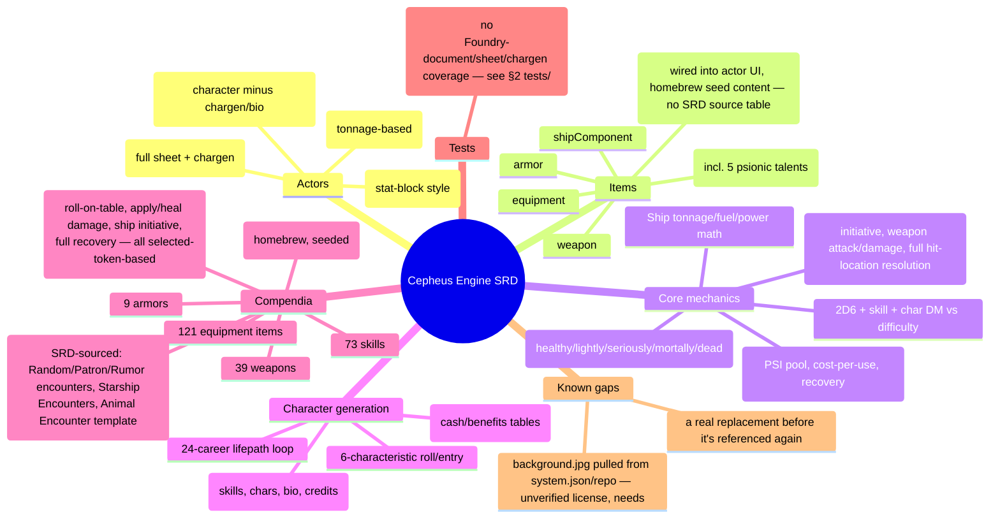

# Cepheus Engine SRD — Project Status & Reference Map

**Purpose of this file:** a single-document map of the system's current state, written so
an AI assistant (or a human) can load it and understand what exists, how it works, and
what's left — without re-reading the whole codebase. Complements `CLAUDE.md` (which
covers *conventions and how-to*); this file covers *what's actually built*.

Last reviewed: 2026-08-18. Re-verify against the code before trusting specifics — this is
a snapshot, not a live source of truth. A git repo was initialized 2026-07-08
(see `git log`); treat file line numbers here as approximate.

2026-08-18: release-prep pass — added LICENSE (MIT, for original code),
OPEN_GAME_LICENSE.txt (verbatim OGL v1.0a + Section 15 copyright chain,
extracted from the SRD PDF), README.md (with the required Cepheus Engine
Compatibility-Statement License disclaimer), CHANGELOG.md, GitHub Actions
CI/release workflows, and filled in system.json's url/manifest/download/
readme/license/bugs/changelog fields against github.com/JoshuaErney/
cepheus-engine. Removed `background` from system.json and untracked both
the personally-watermarked SRD reference PDF and assets/background.jpg
(unverified art license) — see §4.

2026-08-18 (same day, follow-up): first-ever live Foundry v14 session against this
codebase — found and fixed three release-blocking bugs that static review and `bun test`
could not have caught (every actor sheet rendered blank; `system.characteristics` silently
emptied on every prepare cycle; chargen's first paint showed all-zero characteristics). See
§4's "Resolved 2026-08-18" entry for root causes and fixes. The system has now actually been
clicked through — chargen end-to-end, campaign-folder seeding, and full ship combat
(attack → damage → hit resolution) all confirmed working live.

2026-07-26: a structural-consistency pass reorganized shared plumbing (base actor
sheet class, dialog helpers, unified 2d6 check pipeline, config-derived enum
choices, name-based pack sync). Descriptions below reflect the post-refactor
state; none of it has been exercised in a live Foundry session yet (see §4).

---

## 1. High-level map



---

## 2. File-by-file inventory

```
system.json           Manifest. v0.1.0, compat min/verified "14". 7 packs registered
                       (skills/weapons/armor/equipment/augments/tables/macros).
cepheus.mjs            Entry point. Registers doc classes (incl. CepheusCombatant for
                       ship initiative), data models, sheets (per actor type —
                       character/npc/creature/ship each get a distinct sheet class),
                       Handlebars helpers. On `ready` (GM only): syncPack() adds any
                       seed entries missing by name from each of the seven packs —
                       covers both first-launch seeding and system updates that
                       extend a seed file reaching existing worlds.

module/config/config.mjs
  CONFIG.CEPHEUS = { characteristics, characteristicsAbbr, difficulties (6 tiers,
  targets 4/6/8/10/12/14), dmByValue (index 0-15 → DM -3..+2), behaviorTypes (7
  creature behavior enums), spaceCombat (see below) }.
  CEPHEUS.spaceCombat: rangeBands (7), weaponTypes (6), mounts (turret/bay),
  attackDifficulty (weaponType × range → difficulty key, SRD p.149),
  hitLocation (2D6 → external/internal/smallCraft location key, SRD p.159),
  locationLabels (i18n keys — single label source for sheet subsystem rows AND
  hit-resolution chat, localized at use), subsystems (per-location 3-tier
  effect text + overflow target, SRD p.159-161; the ship sheet derives its
  damage-track rows from these keys), mountHits (turret/bay 3-tier tracks),
  crewDamage (2D6 → Crew Damage table entry, SRD p.161).
  Data-model enum `choices` (characteristics, weaponTypes, mounts,
  behaviorTypes) derive from these key lists — config.mjs + lang/en.json are
  the only places to touch when adding an enum value.

module/data/actor-data.mjs
  characteristicField(initial)   → { max, damage } SchemaField shared by all
                                    humanoid/creature characteristics.
  Imports computeCharacteristicDerived/computeWoundState from
    module/helpers/characteristics.mjs — shared by HumanoidData and CreatureData
    (previously duplicated per-class; deduped since both models have a
    `characteristics` SchemaField but don't share a base class; moved to its own
    file so it's unit-testable without a `foundry.*` global — see §2 helpers/).
  HumanoidData (base class, not directly registered)
    - characteristics: str/dex/end/int/edu/soc, each {max,damage}
    - psi: {value, damage}
    - credits
    - prepareDerivedData(): current/value/dm/isDamaged/isDown per characteristic
      (via computeCharacteristicDerived), hex-digit UPP string, PSI current/dm,
      wound state (via computeWoundState). 3 down ⇒ dead; 2 down + END=0 ⇒ dead;
      2 down ⇒ mortally; 1 down ⇒ seriously; any damage ⇒ lightly.
  CharacterData extends HumanoidData
    + age, career, terms, pension, gender, appearance (HTML), personalGoals (HTML),
      biography (HTML), notes (HTML)
  NpcData extends HumanoidData
    + notes only (no chargen fields)
  CreatureData (own TypeDataModel, not Humanoid)
    - characteristics: str/dex/end/int only (no edu/soc/psi)
    - armor, attackDice ("2d6"), attackType, instinct, pack, speed, behaviorType
      (enum: carnivore/herbivore/omnivore/scavenger/hijacker/intermittent/filter),
      notes
    - shares computeCharacteristicDerived/computeWoundState with HumanoidData
  ShipData
    - shipClass, displacement, hullPoints {value,max}, structurePoints {value,max},
      armor, jumpRating (0-6), maneuverRating (0-6), powerPlant (0-6),
      fuel {value,capacity}, cargoCapacity, cargoUsed, crewMin, credits,
      sensorsHits/mDriveHits/jDriveHits/powerPlantHits/bridgeHits/fuelHits/
      holdHits (each 0-3, space-combat subsystem damage tracks), notes
    - prepareDerivedData(): hardpoints = floor(displacement/100); fuelPerJump =
      jumpRating × displacement × 0.1; fuelPerMonth = powerPlant × displacement ×
      0.01; freeCargo = cargoCapacity − cargoUsed; isSmallCraft = displacement < 100
      (selects the Hit Location table column).
    - hullPoints/structurePoints have no `damage` field by design — hit
      resolution and the sheet's Apply Hit action decrement `value` directly.

module/data/item-data.mjs
  SkillData:      level (0-5), characteristic (incl. "psi"), psionic (bool), costPsi,
                   description
  WeaponData:     damage ("2d6"-style string), range, skill (name string, not a
                   reference), magazine, tl, cost, mass, description
  ArmorData:      protection, protectionLaser (nullable — null = same as protection),
                   skillRequired, tl, cost, mass, description
  EquipmentData:  tl, cost, mass, description
  AugmentData:    characteristic (nullable enum), bonus, tl, cost, description
                   (no `mass` field, unlike the other physical item types)
  ShipComponentData: componentType (free string, not enum), tonnage, powerRequired,
                   cost, weaponType (nullable enum, "" = not a weapon), mount
                   ("" / turret / bay), damage (dice string), hits (0-3 turret/bay
                   damage track), description

module/documents/actor.mjs — CepheusActor
  prepareDerivedData(): for ships, sums itemTypes.shipComponent into usedTonnage /
    usedPower (not enforced against capacity — purely informational).
  getRollData(): exposes characteristics.<key>.{value,max,damage,current,dm} to
    Roll formulas / initiative ("2d6 + @characteristics.dex.dm" in system.json).
  findSkillByName / getSkillLevel(): unskilled use = -3, reduced by
    Jack-of-All-Trades level (min 0 penalty once JoT is high enough).
  rollCharacteristic(key): 2d6 + char.dm + woundPenalty → chat message.
  rollSkill(item, {characteristicKey, difficulty}): 2d6 + char.dm + skill.level +
    woundPenalty vs difficulty target; posts success/failure to chat.
  _promptDifficulty() / _promptRange(): promptSelect (helpers/dialogs.mjs)
    pickers for shift-click difficulty override / space-combat range band.
  All check-style rolls (rollSkill/rollAttack/rollPsionic/rollShipAttack) run
    through helpers/dice.mjs evaluateCheck() + formatCheckFlavor() — one
    implementation of the 2d6-vs-target mechanic and one chat-card format.
  rollAttack(weaponItem, {characteristicKey, difficulty, promptDifficulty}):
    infers STR (melee) vs DEX (ranged) from `range.startsWith("Melee")`; totals
    skill level (via getSkillLevel, so unskilled use is penalized) + char DM +
    wound penalty; rich chat flavor with color-coded success/fail.
  testPsionics(): 2d6 − terms served = PSI score (SRD psionic-strength test);
    writes system.psi.value, resets damage to 0.
  rollPsionic(skillItem, opts): validates PSI availability/cost, deducts cost as
    psi.damage, rolls PSI-dm + skill level vs difficulty.
  recoverPsi(amount): reduces psi.damage, floored at 0.
  rollDamage(weaponItem): rolls the weapon's damage string; bails gracefully (chat
    info message, no roll) if the damage field is descriptive text instead of a
    dice formula (e.g. "By grenade").
  rollCreatureAttack(): flat system.attackDice roll for creatures (no skill/DM
    math) — on the document, not the sheet, so macros can reach it.
  applyDamage(total) / healDamage(total): distributes damage across
    END→STR→DEX (damage) or DEX→STR→END (heal) in that priority order, respecting
    each characteristic's current remaining capacity.
  fullRecovery(): zeroes all characteristic damage.
  _notifyWoundState(): UI warning toast when wound state is seriously/mortally/dead.

  Ship combat (SRD Chapter 10, full hit-location system):
  rollShipInitiative({thrustAdvantage, tacticsEffect}): 2d6 + DM(+1 if greater
    Thrust than opponent) + Captain's Tactics-check Effect.
  rollShipAttack(componentItem, {range, skillLevel, dm}): Turret/Bay Weapons
    check vs the weapon-type × range difficulty (CEPHEUS.spaceCombat.attackDifficulty);
    refuses to fire if the component isn't a weapon, is disabled (hits≥2), or
    can't reach that range; applies the tier-1 tracking-damage DM-2 automatically.
  rollShipWeaponDamage(componentItem): rolls the component's damage formula.
  applyShipDamage(rawDamage, {radiation}): subtracts armor, converts the result
    to single/double/triple hits via damageToHits(), rolls Hit Location once per
    hit (twice/thrice applied to the same location for double/triple hits per
    SRD), and resolves each: Hull/Structure/Armor decrement directly; Sensors/
    M-Drive/J-Drive/Power Plant/Bridge/Fuel/Hold increment a 0-3 ship-level tier
    track (fuel/hold tiers also roll and actually consume the tracked resource);
    Turret/Bay pick a random matching weapon component and increment its own
    0-3 `hits` track; Crew rolls the Crew Damage table and reports the result
    for the GM to apply manually (no crew roster exists in this system). Hits
    beyond tier 3 redirect to Hull or Structure per the SRD's "Subsequent Hits"
    rule. Posts one consolidated chat message per call.
  _resolveShipHitLocation / _applyShipMountHit / _rollShipCrewDamage: internal
    orchestration helpers for the above.

module/documents/item.mjs   (9 lines) — CepheusItem, currently just the bare
  subclass with no overrides (hook point for future item-level logic).

module/documents/combatant.mjs — CepheusCombatant: _getInitiativeFormula()
  returns flat "2d6" for ship actors (the global dex-based tracker formula
  can't apply — ships have no characteristics; situational SRD modifiers come
  from the ship sheet's Roll Initiative prompt instead).

module/helpers/dice.mjs — the canonical 2d6 pipeline. evaluateCheck({dm,
  difficulty}) rolls vs the difficulty table; formatCheckFlavor() builds the
  standard chat block (title — kind / muted detail / ✔✘ result, styled by
  cepheus-chat-* CSS classes, no inline styles); rollCheck() is the standalone
  macro-friendly wrapper. Pure, unit-tested string helpers:
  normalizeDiceFormula/isDiceFormula (seed data mixes "2D6"/"2d6"; some damage
  entries are descriptive text), signed() for DM formatting. Every check-style
  roll in actor.mjs runs through this module.

module/helpers/dialogs.mjs — single home for input dialogs: promptForm (typed
  field list → DialogV2, returns {name: value} or null), promptNumber,
  promptSelect. Labels pass through game.i18n.localize (unknown strings pass
  unchanged). All sheet/document prompts route through these.

module/helpers/form.mjs — preventEnterSubmit(): blocks the native Enter-key
  form submit that double-fires alongside submitOnChange autosave; wired by
  the base actor sheet's _onRender and the item sheet.

module/helpers/spacecombat.mjs — pure functions used by actor.mjs's ship-combat
  methods: damageToHits(damage) (Space Combat Damage table, SRD p.159) and
  applyTieredHit(current, amount, max) (0-3 tier math with overflow reporting).

module/helpers/characteristics.mjs — computeCharacteristicDerived(characteristics)
  / computeWoundState(characteristics), extracted out of actor-data.mjs (which
  imports and uses them) specifically so they're importable and unit-testable
  without any `foundry.*` global — see tests/characteristics.test.mjs.

module/helpers/handlebars.mjs — registers: cepheusSign (± formatting), cepheusHex
  (0-15 → hex digit, used for UPP display), includes (array membership), keys
  (Object.keys, used in chargen skill tables), inc (1-based @index).
```

### Sheets

All four actor sheets extend a shared base; templates read actor data as
`{{system.x}}` (the base passes `this.actor.system` into context) rather than
sheets re-flattening fields.

```
module/sheets/base-actor-sheet.mjs — CepheusBaseActorSheet (shared base)
  Owns: _getTabs() driven by each subclass's static TABS list (labels resolve
  to CEPHEUS.Tab<Id>; first entry = initial tab), _preparePartContext tab
  wiring, _prepareContext (tabs + system), _onRender → preventEnterSubmit,
  form.submitOnChange, and the actions identical across actor types:
  createItem (data-type attr), editItem, deleteItem, applyDamage, healDamage
  (promptNumber dialogs), fullRecovery.

module/sheets/actor-sheet.mjs — CepheusActorSheet (character) extends base
  PARTS: header, tabs, characteristics, skills, equipment, biography, notes.
  Own actions: startChargen, rollCharacteristic, rollSkill, rollAttack,
  rollDamage, rollPsionic, testPsionics, recoverPsi.
  Context adds itemTypes lists (skills/weapons/armor/equipment/augments),
  charConfig, and isCharacter — header.hbs gates the chargen button on it
  (the template is shared with NPCs, whose schema lacks chargen fields).

module/sheets/npc-sheet.mjs — CepheusNpcSheet extends CepheusActorSheet.
  Overrides PARTS (drops biography, npc-specific notes), TABS, classes,
  position — nothing else; all handlers and context inherited.

module/sheets/creature-sheet.mjs — CepheusCreatureSheet extends base
  PARTS: header, tabs, stats, notes. Own action: rollAttack → delegates to
  actor.rollCreatureAttack(). Damage/heal/recovery come from the base.

module/sheets/ship-sheet.mjs — CepheusShipSheet extends base
  PARTS: header, tabs, statistics, components, notes.
  Own actions: rollInitiative, rollAttack, rollWeaponDamage, applyShipHit,
  adjustSystemHit, adjustMountHit. rollInitiative/applyShipHit use promptForm
  (thrust advantage + tactics effect; raw damage + radiation flag) then
  delegate to the matching CepheusActor ship-combat method. The Add Component
  button uses the base createItem with data-type="shipComponent".
  systemHitRows derive from CEPHEUS.spaceCombat.subsystems keys +
  locationLabels — adding a subsystem needs only a config entry and a
  <key>Hits schema field.

module/sheets/item-sheet.mjs — CepheusItemSheet, one sheet class for
  all 6 item types; body.hbs branches per itemType. rollAttack/rollDamage actions
  delegate to the owning actor if the item is embedded. (Own hierarchy —
  ItemSheetV2, not the actor base — but same submitOnChange/preventEnterSubmit
  wiring.)

module/apps/chargen.mjs   (491 lines) — CepheusChargenApp (ApplicationV2)
  Full lifepath wizard, steps: characteristics → career → terms (loop) →
  musterout → review/apply.
  - Characteristics: auto-rolled before first render (free), then a shared
    3-reroll pool covers individual rerolls and Reroll All; no manual entry.
    UPP key list (CHAR_KEYS) and abbreviations derive from config.mjs.
  - Career: select from CAREERS, roll qualification (auto-pass for Drifter),
    fail-forward into Drifter on a failed qualification roll.
  - Per term: survival roll (failure ends career immediately, still counts the
    term) → skill picks (2 rolls/term for the 7 no-advancement careers, else 1,
    +1 bonus specialist pick on commission) → commission roll (once, before first
    advancement roll) → advancement roll (rank increase + rank skill) →
    reenlistment roll (natural 12 forces another term even past the 7-term cap;
    failure forces muster-out; 7th term forces retirement barring the nat-12
    exception; otherwise player's choice via nextTerm/endCareer actions).
  - _applySkillEntry: parses "+N CHAR" as a characteristic bonus, otherwise
    increments a running per-skill pick counter (first pick → level 0, each
    subsequent pick → +1), matching SRD skill-table rules.
  - Muster-out: 1D6 rolls against career cash/benefit tables, capped at 3 cash
    rolls per character; characteristic-boost benefits feed back into
    charBonuses.
  - Pension: terms ≥5 → Cr10,000 + Cr2,000 per term beyond 5 (SRD p.30).
  - Apply: writes final characteristics (base + bonuses, clamped 1-15, damage
    reset to 0), credits, age (18 + terms×4), pension, career name/terms,
    gender/appearance/personalGoals (read directly from rendered inputs —
    chargen.hbs has no <form> wrapper, noted in-code), a generated biography
    paragraph, and creates/merges skill items (merging correctly accounts for
    pre-existing skill levels — verified not a double-count bug, see review
    notes).
```

### Templates (`templates/`)

All `systems/cepheus-engine/templates/...` paths referenced in code were verified
to exist on disk (no dangling references as of last review).

```
actor/header.hbs, characteristics.hbs, skills.hbs, equipment.hbs, biography.hbs,
  notes.hbs                          — character (also reused by npc where noted)
actor/npc/notes.hbs                  — npc-specific notes tab
actor/creature/header.hbs, stats.hbs, notes.hbs
actor/ship/header.hbs, statistics.hbs, components.hbs, notes.hbs
apps/chargen.hbs                     — single-file wizard UI, all steps
item/header.hbs, body.hbs            — body.hbs branches per item type
```

`templates/generic/tab-navigation.hbs` referenced with no `systems/...` prefix —
that's intentional, it's Foundry core's shared tab-nav partial, not a project file.

### Compendia (`packs/`)

LevelDB-format packs (LOCK/LOG/CURRENT/MANIFEST — normal for Foundry v11+, but
means the repo has no diffable JSON source for pack contents; the seed files in
`module/data/seeds/*.mjs` are the real source of truth and get pushed into these
packs on first `ready` hook if the pack is empty).

| Pack        | Seed file                     | Count |
|-------------|--------------------------------|-------|
| skills      | module/data/seeds/skills.mjs   | 73 (incl. 5 psionic talents: Awareness, Clairvoyance, Telekinesis, Telepathy, Teleportation) |
| weapons     | module/data/seeds/weapons.mjs  | 39 |
| armor       | module/data/seeds/armor.mjs    | 9 |
| equipment   | module/data/seeds/equipment.mjs| 121 |
| augments    | module/data/seeds/augments.mjs | 12 (homebrew — no SRD source table for cybernetics/bio-augments, see below) |
| tables      | module/data/seeds/tables.mjs   | 5 RollTables, direct SRD transcriptions: Random Encounters (D66, p.187), Patron Encounters (D66, p.188), Random Rumor Content (D66, pp.190-191), Starship Encounters (2D6, p.193), Animal Encounter 2D6 Template (p.184). D66 uses formula `(1d6*10)+1d6`. Narrower per-vessel-type sub-tables (Alien Vessel, Derelict, etc., pp.193-195) and the 1D6 Animal Encounter Template (p.183) exist in the SRD but weren't included — candidates for future expansion. |
| macros      | module/data/seeds/macros.mjs   | 5 script macros (scope "global", operate on `canvas.tokens.controlled`): Roll on Table (prompts a table from the `tables` pack and draws it), Apply Damage to Selected, Heal Selected, Roll Ship Initiative, Full Recovery (Selected). |

### Career data (`module/data/careers.mjs`, 523 lines)

24 careers transcribed from SRD pp.33-40, each with: qualification/survival/
commission/advancement targets (char + target number), reenlistment target,
rank titles (7 ranks), rank skills, 4 skill tables (personal/service/specialist/
advanced), cash table (6 entries), benefits table (6 entries). Extensive in-code
comments document two known SRD table transcription oddities (a "Perception" and
two "Prospecting" entries with no matching skill, mapped to the closest real
skill) and the rationale for treating cascade skills as their generic name.

Full list: Aerospace System Defense, Agent, Athlete, Barbarian, Belter,
Bureaucrat, Colonist, Diplomat, Drifter, Entertainer, Hunter, Marine, Maritime
System Defense, Mercenary, Merchant, Navy, Noble, Physician, Pirate, Rogue,
Scientist, Scout, Surface System Defense, Technician.

### Localization (`lang/en.json`)

193 keys under `TYPES.*` and `CEPHEUS.*`. Verified complete against every
literal `{{localize "CEPHEUS.X"}}` call in templates/JS — no missing keys as of
last review (dynamic keys like `CEPHEUS.Tab${id}` / `CEPHEUS.Wound${state}` were
checked by hand against their possible expansions and all resolve). Chat-message
flavor text built in JS (actor.mjs's roll methods, ship-combat subsystem effect
descriptions in config.mjs) intentionally uses hardcoded English strings rather
than localization keys, matching the pre-existing convention for that layer —
only template-rendered UI text and dialog labels go through `lang/en.json`.

### Tests (`tests/`, run via `bun test`)

86 tests, no test dependencies beyond the `bun` binary itself (`bun:test` is
built in). `bunfig.toml` preloads `tests/setup.mjs`, which stubs only
`Math.clamp` and `CONFIG.CEPHEUS` (imported from the real config.mjs, not
duplicated) — the minimal slice of the Foundry runtime the pure-logic modules
need. Nothing touching `foundry.abstract`, `Actor`/`Item` documents, sheets,
`Roll`/`ChatMessage`/`DialogV2`, or `chargen.mjs` is covered — that would
require a live Foundry environment or a much heavier mock and is out of scope
for this suite (see Known Issue 1 re: not yet exercised live).

```
tests/setup.mjs               Preload: Math.clamp polyfill + CONFIG.CEPHEUS stub.
tests/spacecombat.test.mjs    damageToHits() against every SRD Space Combat
                               Damage table boundary; applyTieredHit() overflow math.
tests/dice.test.mjs           normalizeDiceFormula/isDiceFormula (case/whitespace,
                               descriptive-text rejection) and signed() formatting.
tests/characteristics.test.mjs computeCharacteristicDerived()/computeWoundState()
                               against hand-built characteristic objects — DM table
                               edges, all 5 wound-state tiers.
tests/careers.test.mjs        Structural sanity on all 24 CAREERS entries (valid
                               characteristic keys, 7-entry rankTitles, 6-entry
                               cash/benefits, no-commission careers have null
                               commission/advancement per SRD p.29).
tests/seeds.test.mjs          Item-pack seed counts (73/39/9/121/12) and shape;
                               TABLES_SEED D66/2D6 range coverage (no gaps/overlaps);
                               MACROS_SEED command strings parse as valid JS.
tests/localization.test.mjs   Every statically-referenced `CEPHEUS.*` localize key
                               (across templates/*.hbs and module/**/*.mjs) exists
                               in lang/en.json; every system.json documentType has
                               a TYPES label. Dynamic keys (template-literal built)
                               are skipped — same caveat as the manual verification
                               this replaces.
```

---

## 3. Core mechanics reference (as implemented, not just as spec'd)

- **Task resolution:** `2d6 + skill.level + characteristic.dm + woundPenalty ≥ difficulty.target`.
  Unskilled use = −3 (reduced toward 0 by Jack-of-All-Trades level).
- **Wound penalty:** 0 healthy, −1 lightly wounded, −2 seriously/mortally wounded — applied
  automatically inside rollCharacteristic/rollSkill/rollAttack/rollPsionic.
- **DM table:** value 0-1→−3, 2-2→−2 *(actually index-based, see `dmByValue` array —
  index = clamped characteristic value 0-15)*: `[-3,-2,-2,-1,-1,-1,0,0,0,1,1,1,2,2,2,2]`.
- **Psionics:** PSI pool = 2d6 − terms served (min 0) via testPsionics; each power use
  costs `skill.system.costPsi` PSI, tracked as psi.damage; psi.dm derives from *current*
  (post-spend) PSI, so spending reduces future roll quality within the same pool.
- **Ships:** hardpoints = ⌊displacement/100⌋; fuel/jump = jumpRating × 10% displacement;
  fuel/month = powerPlant × 1% displacement; component tonnage/power usage summed but not
  capacity-enforced (no validation error if you overfit a hull).
- **Space combat (SRD ch.10):** raw weapon damage − ship armor → Space Combat Damage
  table → N single/double/triple hits → one 2D6 Hit Location roll per hit (column by
  Hull>0/=0/isSmallCraft) → effect applied (Hull/Structure/Armor decrement; Sensors/
  M-Drive/J-Drive/Power Plant/Bridge/Fuel/Hold 0-3 tier tracks with SRD effect text;
  Turret/Bay hits land on a random matching weapon component's own 0-3 track; Crew
  hits roll the Crew Damage table for manual GM application). Hits beyond tier 3
  redirect to Hull or Structure per the SRD. One damage-table interpretation is a
  documented judgment call: see the comment in `module/helpers/spacecombat.mjs`
  `damageToHits()` for damage >44 (the SRD text is ambiguous about compounding there).

---

## 4. Known issues (unfixed as of last review)

1. **No system background image.** `assets/background.jpg` (a "burning astronaut" wallpaper of
   unverified origin/license) was removed from `system.json` and gitignored rather than shipped
   with unclear rights — needs a real replacement (original art, a properly licensed image, or
   confirmed permission) before `background` is set again.

Resolved 2026-08-18 (ship component capacity — warn, don't block): added `isOverTonnage`/
`isOverPower` derived booleans on `ShipData` (actor.mjs's `prepareDerivedData`, alongside the
existing `usedTonnage`/`usedPower` sums), comparing against `displacement` and `powerPlant`
respectively. `powerPlant`'s 0-6 rating is treated as the power budget directly (matches how
`powerRequired` is already entered by hand per component; no new SRD-external formula
introduced). The Components tab now shows both totals as "used / capacity" and highlights
either in red with a warning icon when exceeded (`.over-capacity` in cepheus.css,
`CEPHEUS.OverCapacity` in lang/en.json) — deliberately a soft warning, not a hard block, so a
GM can still knowingly build an over-budget ship.

Resolved 2026-08-18 (first live Foundry v14 session — three release-blocking bugs found and
fixed, none of which static review had caught):
- **Every actor sheet rendered blank below the header, on every actor type.** `_getTabs()`
  (base-actor-sheet.mjs) computes an `active`/`cssClass` per tab, consumed correctly by
  `templates/generic/tab-navigation.hbs` for the nav — but none of the 11 tab-content
  templates (characteristics/skills/equipment/biography/notes × character/npc/creature/ship)
  ever applied that class to their own `<section class="tab ...">`. Foundry core CSS hides
  any `.tab` without `.active`, so no tab body was ever visible. Fixed by adding
  `{{tab.cssClass}}` to each section's class list.
- **`system.characteristics` silently emptied on every data-prep cycle for character/npc/
  creature actors** (ships unaffected). `CepheusActor#getRollData()` called
  `super.getRollData()`, which — per Foundry's own documented warning — returns `this.system`
  *by reference*, not a copy. The override then did `data.characteristics = {}` before
  reading from `sys.characteristics` in the same loop; since `data`/`sys`/`this.system` were
  all the same object, that line wiped the live characteristics first, so the loop iterated
  zero entries. Foundry calls `getRollData()` from `applyActiveEffects("initial")`, which runs
  before the data model's own `prepareDerivedData()` on every single prepare cycle — so this
  reproduced on a bare `Actor.create()` with no chargen involved, on every load. Persisted
  data (`_source`) was never affected, only the in-memory prepared model. Fixed by
  shallow-copying `super.getRollData()` before mutating.
- **Chargen's Step 1 showed all-zero characteristics on first open**, despite claiming
  "rolled automatically" and logging as much. `ApplicationV2#render()` calls
  `_prepareContext()` *before* `_preFirstRender()` (confirmed against Foundry's own source),
  so a roll performed in `_preFirstRender` always arrives one context-snapshot too late for
  the first paint. Fixed by moving the auto-roll into `_prepareContext()` itself, guarded by
  the existing `_autoRolled` flag.

All three were caught only by actually driving a live Foundry v14 session (world creation,
chargen, ship combat) via a scripted Playwright harness — static review and `bun test` (which
can't touch `foundry.abstract`/sheets/chargen, see §2 tests/) had no way to catch any of them.
Also fixed in the same pass: a stale `systems/cepheus-engine` symlink on the dev machine
pointing at a nonexistent path.

Resolved 2026-07-26 (structural-consistency pass): duplicated sheet plumbing
(four sheets now share CepheusBaseActorSheet), eight hand-rolled DialogV2
prompts (helpers/dialogs.mjs; macros use the game.cepheus API), five parallel
implementations of the 2d6 check + inline-styled chat HTML (helpers/dice.mjs +
cepheus-chat-* classes), enum choices duplicated between config and schemas,
the dual subsystem label systems (locationLabels i18n keys are now the single
source), creature attack living on the sheet, flattened-vs-system context
conventions, the ungated chargen button on NPC sheets, ships hitting the
dex-based tracker formula (CepheusCombatant), and skills-only pack patching
(syncPack covers all seven packs).

Resolved since the last review (2026-07-08 → 2026-07-09): ship damage buttons
writing a nonexistent schema field, augments being unreachable from actor sheets,
no augment compendium content, no version control, duplicated wound-state logic
between HumanoidData/CreatureData, no ship-to-ship combat resolution beyond manual
damage-number entry, no macro/rollable-table content, and no automated tests. See
`git log` for details.

---

## 5. Not yet started

- Regions-based AoE tooling (CLAUDE.md notes Measured Templates are removed in v14 in
  favor of Regions — nothing in the system currently uses either, presumably not needed
  yet given no template-based weapons/powers exist)
- Missiles, screens, sand, and boarding actions from SRD ch.10 (space combat covers
  initiative/attack/damage/full hit-location resolution only — see §3)
- The narrower SRD encounter sub-tables and chained RollTable draws (e.g. rolling
  Starship Encounters → automatically drawing from the matching vessel-type
  sub-table) — see the `tables` pack note in §2 for what's included vs not

---

## 6. How to regenerate/verify this file

This file is a manually-curated snapshot, not generated. To refresh it:
1. Re-run the file inventory (`find . -type f -not -path './.git/*'`).
2. Re-diff localization keys used in templates/JS against `lang/en.json`.
3. Re-check the flagged issues above against current code before assuming they're
   still open, and check `git log` for changes since the "Last reviewed" date.
4. Update the "Last reviewed" date at the top.
