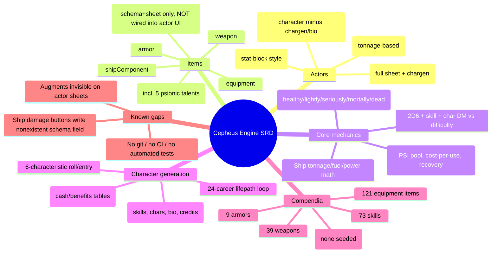

# Cepheus Engine SRD — Project Status & Reference Map

**Purpose of this file:** a single-document map of the system's current state, written so
an AI assistant (or a human) can load it and understand what exists, how it works, and
what's left — without re-reading the whole codebase. Complements `CLAUDE.md` (which
covers *conventions and how-to*); this file covers *what's actually built*.

Last reviewed: 2026-07-08. Re-verify against the code before trusting specifics — this is
a snapshot, not a live source of truth. No git repo exists yet, so there's no commit
history to diff against; treat file line numbers here as approximate.

---

## 1. High-level map



---

## 2. File-by-file inventory

```
system.json           Manifest. v0.1.0, compat min/verified "14". 4 packs registered
                       (skills/weapons/armor/equipment — no augments pack).
cepheus.mjs            Entry point. Registers doc classes, data models, sheets (per
                       actor type — character/npc/creature/ship each get a distinct
                       sheet class), Handlebars helpers. On `ready` (GM only): seeds
                       empty compendiums from the seed files, then patches the skills
                       pack with any seed entries missing from an existing world's copy.

module/config/config.mjs
  CONFIG.CEPHEUS = { characteristics, characteristicsAbbr, difficulties (6 tiers,
  targets 4/6/8/10/12/14), dmByValue (index 0-15 → DM -3..+2), behaviorTypes (7
  creature behavior enums) }.

module/data/actor-data.mjs   (190 lines)
  characteristicField(initial)   → { max, damage } SchemaField shared by all
                                    humanoid/creature characteristics.
  HumanoidData (base class, not directly registered)
    - characteristics: str/dex/end/int/edu/soc, each {max,damage}
    - psi: {value, damage}
    - credits
    - prepareDerivedData(): computes current/value/dm/isDamaged/isDown per
      characteristic, hex-digit UPP string, PSI current/dm, wound state.
    - _computeWoundState(): STR/DEX/END-based — 3 down ⇒ dead; 2 down + END=0 ⇒
      dead; 2 down ⇒ mortally; 1 down ⇒ seriously; any damage ⇒ lightly.
      Matches the wound table documented in CLAUDE.md exactly.
  CharacterData extends HumanoidData
    + age, career, terms, pension, gender, appearance (HTML), personalGoals (HTML),
      biography (HTML), notes (HTML)
  NpcData extends HumanoidData
    + notes only (no chargen fields)
  CreatureData (own TypeDataModel, not Humanoid)
    - characteristics: str/dex/end/int only (no edu/soc/psi)
    - armor, attackDice ("2D6"), attackType, instinct, pack, speed, behaviorType
      (enum: carnivore/herbivore/omnivore/scavenger/hijacker/intermittent/filter),
      notes
    - own copy of the wound-state logic (duplicated from HumanoidData, not shared —
      minor DRY opportunity, not a bug)
  ShipData
    - shipClass, displacement, hullPoints {value,max}, structurePoints {value,max},
      armor, jumpRating (0-6), maneuverRating (0-6), powerPlant (0-6),
      fuel {value,capacity}, cargoCapacity, cargoUsed, crewMin, credits, notes
    - prepareDerivedData(): hardpoints = floor(displacement/100); fuelPerJump =
      jumpRating × displacement × 0.1; fuelPerMonth = powerPlant × displacement ×
      0.01; freeCargo = cargoCapacity − cargoUsed.
    - ⚠ hullPoints/structurePoints have NO `damage` field — see §4 Issue 1.

module/data/item-data.mjs   (86 lines)
  SkillData:      level (0-5), characteristic (incl. "psi"), psionic (bool), costPsi,
                   description
  WeaponData:     damage ("2d6"-style string), range, skill (name string, not a
                   reference), magazine, tl, cost, mass, description
  ArmorData:      protection, protectionLaser (nullable — null = same as protection),
                   skillRequired, tl, cost, mass, description
  EquipmentData:  tl, cost, mass, description
  AugmentData:    characteristic (nullable enum), bonus, tl, cost, description
                   (no `mass` field, unlike the other physical item types)
  ShipComponentData: componentType (free string, not enum), tonnage, powerRequired,
                   cost, description

module/documents/actor.mjs   (299 lines) — CepheusActor
  prepareDerivedData(): for ships, sums itemTypes.shipComponent into usedTonnage /
    usedPower (not enforced against capacity — purely informational).
  getRollData(): exposes characteristics.<key>.{value,max,damage,current,dm} to
    Roll formulas / initiative ("2d6 + @characteristics.dex.dm" in system.json).
  findSkillByName / getSkillLevel(): unskilled use = -3, reduced by
    Jack-of-All-Trades level (min 0 penalty once JoT is high enough).
  rollCharacteristic(key): 2d6 + char.dm + woundPenalty → chat message.
  rollSkill(item, {characteristicKey, difficulty}): 2d6 + char.dm + skill.level +
    woundPenalty vs difficulty target; posts success/failure to chat.
  _promptDifficulty(): DialogV2 select-box for shift-click difficulty override,
    shared by rollAttack/rollPsionic.
  rollAttack(weaponItem, {characteristicKey, difficulty, promptDifficulty}):
    infers STR (melee) vs DEX (ranged) from `range.startsWith("Melee")`; totals
    skill level (via getSkillLevel, so unskilled use is penalized) + char DM +
    wound penalty; rich chat flavor with color-coded success/fail.
  testPsionics(): 2d6 − terms served = PSI score (SRD psionic-strength test);
    writes system.psi.value, resets damage to 0.
  rollPsionic(skillItem, opts): validates PSI availability/cost, deducts cost as
    psi.damage, rolls PSI-dm + skill level vs difficulty.
  recoverPsi(amount): reduces psi.damage, floored at 0.
  rollDamage(weaponItem): rolls the weapon's damage string; bails gracefully (chat
    info message, no roll) if the damage field is descriptive text instead of a
    dice formula (e.g. "By grenade").
  applyDamage(total) / healDamage(total): distributes damage across
    END→STR→DEX (damage) or DEX→STR→END (heal) in that priority order, respecting
    each characteristic's current remaining capacity.
  fullRecovery(): zeroes all characteristic damage.
  _notifyWoundState(): UI warning toast when wound state is seriously/mortally/dead.

module/documents/item.mjs   (9 lines) — CepheusItem, currently just the bare
  subclass with no overrides (hook point for future item-level logic).

module/helpers/dice.mjs — rollCheck({dm, difficulty, flavor, speaker}): standalone
  2d6+dm vs difficulty helper, usable from macros independent of an actor.

module/helpers/handlebars.mjs — registers: cepheusSign (± formatting), cepheusHex
  (0-15 → hex digit, used for UPP display), includes (array membership), keys
  (Object.keys, used in chargen skill tables), inc (1-based @index).
```

### Sheets

```
module/sheets/actor-sheet.mjs   (198 lines) — CepheusActorSheet (character)
  PARTS: header, tabs, characteristics, skills, equipment, biography, notes.
  actions: startChargen, rollCharacteristic, rollSkill, rollAttack, rollDamage,
  rollPsionic, testPsionics, recoverPsi, createItem, editItem, deleteItem,
  applyDamage, healDamage, fullRecovery.
  Context includes `augments` (itemTypes.augment) but no template consumes it — see
  §4 Issue 2.

module/sheets/npc-sheet.mjs — CepheusNpcSheet extends CepheusActorSheet.
  Same PARTS minus biography, swaps notes template for an NPC-specific one.
  Reuses all inherited action handlers (chargen action is inherited but presumably
  unused/hidden in the npc header template — verify template before assuming it's
  reachable).

module/sheets/creature-sheet.mjs   (127 lines) — CepheusCreatureSheet
  Own PARTS (header, tabs, stats, notes) — does NOT extend CepheusActorSheet.
  actions: rollAttack (rolls system.attackDice flat, no skill/DM math — creatures
  don't have skills), applyDamage, healDamage, fullRecovery.

module/sheets/ship-sheet.mjs   (154 lines) — CepheusShipSheet
  Own PARTS (header, tabs, statistics, components, notes).
  actions: createComponent, editItem, deleteItem, applyHullDamage,
  applyStructureDamage.
  ⚠ applyHullDamage/applyStructureDamage write system.hullPoints.damage /
  system.structurePoints.damage — see §4 Issue 1.

module/sheets/item-sheet.mjs   (42 lines) — CepheusItemSheet, one sheet class for
  all 6 item types; body.hbs branches per itemType. rollAttack/rollDamage actions
  delegate to the owning actor if the item is embedded.

module/apps/chargen.mjs   (491 lines) — CepheusChargenApp (ApplicationV2)
  Full lifepath wizard, steps: characteristics → career → terms (loop) →
  musterout → review/apply.
  - Characteristics: roll-all or roll-individual buttons, or manual entry
    (clamped 1-15 on advance).
  - Career: select from CAREERS, roll qualification (auto-pass for Drifter),
    fail-forward into Drifter on a failed qualification roll.
  - Per term: survival roll (failure ends career immediately, still counts the
    term) → skill picks (2 rolls/term for the 7 no-advancement careers, else 1,
    +1 bonus specialist pick on commission) → commission roll (once, before first
    advancement roll) → advancement roll (rank increase + rank skill) →
    reenlistment roll (natural 12 forces another term even past the 7-term cap;
    failure forces muster-out; 7th term forces retirement barring the nat-12
    exception; otherwise player's choice via nextTerm/endCareer actions).
  - _applySkillEntry: parses "+N CHAR" as a characteristic bonus, otherwise
    increments a running per-skill pick counter (first pick → level 0, each
    subsequent pick → +1), matching SRD skill-table rules.
  - Muster-out: 1D6 rolls against career cash/benefit tables, capped at 3 cash
    rolls per character; characteristic-boost benefits feed back into
    charBonuses.
  - Pension: terms ≥5 → Cr10,000 + Cr2,000 per term beyond 5 (SRD p.30).
  - Apply: writes final characteristics (base + bonuses, clamped 1-15, damage
    reset to 0), credits, age (18 + terms×4), pension, career name/terms,
    gender/appearance/personalGoals (read directly from rendered inputs —
    chargen.hbs has no <form> wrapper, noted in-code), a generated biography
    paragraph, and creates/merges skill items (merging correctly accounts for
    pre-existing skill levels — verified not a double-count bug, see review
    notes).
```

### Templates (`templates/`)

All `systems/cepheus-engine/templates/...` paths referenced in code were verified
to exist on disk (no dangling references as of last review).

```
actor/header.hbs, characteristics.hbs, skills.hbs, equipment.hbs, biography.hbs,
  notes.hbs                          — character (also reused by npc where noted)
actor/npc/notes.hbs                  — npc-specific notes tab
actor/creature/header.hbs, stats.hbs, notes.hbs
actor/ship/header.hbs, statistics.hbs, components.hbs, notes.hbs
apps/chargen.hbs                     — single-file wizard UI, all steps
item/header.hbs, body.hbs            — body.hbs branches per item type
```

`templates/generic/tab-navigation.hbs` referenced with no `systems/...` prefix —
that's intentional, it's Foundry core's shared tab-nav partial, not a project file.

### Compendia (`packs/`)

LevelDB-format packs (LOCK/LOG/CURRENT/MANIFEST — normal for Foundry v11+, but
means the repo has no diffable JSON source for pack contents; the seed files in
`module/data/seeds/*.mjs` are the real source of truth and get pushed into these
packs on first `ready` hook if the pack is empty).

| Pack        | Seed file                     | Count |
|-------------|--------------------------------|-------|
| skills      | module/data/seeds/skills.mjs   | 73 (incl. 5 psionic talents: Awareness, Clairvoyance, Telekinesis, Telepathy, Teleportation) |
| weapons     | module/data/seeds/weapons.mjs  | 39 |
| armor       | module/data/seeds/armor.mjs    | 9 |
| equipment   | module/data/seeds/equipment.mjs| 121 |
| *(none)*    | *(no augment seed exists)*     | 0 |

### Career data (`module/data/careers.mjs`, 523 lines)

24 careers transcribed from SRD pp.33-40, each with: qualification/survival/
commission/advancement targets (char + target number), reenlistment target,
rank titles (7 ranks), rank skills, 4 skill tables (personal/service/specialist/
advanced), cash table (6 entries), benefits table (6 entries). Extensive in-code
comments document two known SRD table transcription oddities (a "Perception" and
two "Prospecting" entries with no matching skill, mapped to the closest real
skill) and the rationale for treating cascade skills as their generic name.

Full list: Aerospace System Defense, Agent, Athlete, Barbarian, Belter,
Bureaucrat, Colonist, Diplomat, Drifter, Entertainer, Hunter, Marine, Maritime
System Defense, Mercenary, Merchant, Navy, Noble, Physician, Pirate, Rogue,
Scientist, Scout, Surface System Defense, Technician.

### Localization (`lang/en.json`)

154 keys under `TYPES.*` and `CEPHEUS.*`. Verified complete against every
literal `{{localize "CEPHEUS.X"}}` call in templates/JS — no missing keys as of
last review (dynamic keys like `CEPHEUS.Tab${id}` / `CEPHEUS.Wound${state}` were
checked by hand against their possible expansions and all resolve).

---

## 3. Core mechanics reference (as implemented, not just as spec'd)

- **Task resolution:** `2d6 + skill.level + characteristic.dm + woundPenalty ≥ difficulty.target`.
  Unskilled use = −3 (reduced toward 0 by Jack-of-All-Trades level).
- **Wound penalty:** 0 healthy, −1 lightly wounded, −2 seriously/mortally wounded — applied
  automatically inside rollCharacteristic/rollSkill/rollAttack/rollPsionic.
- **DM table:** value 0-1→−3, 2-2→−2 *(actually index-based, see `dmByValue` array —
  index = clamped characteristic value 0-15)*: `[-3,-2,-2,-1,-1,-1,0,0,0,1,1,1,2,2,2,2]`.
- **Psionics:** PSI pool = 2d6 − terms served (min 0) via testPsionics; each power use
  costs `skill.system.costPsi` PSI, tracked as psi.damage; psi.dm derives from *current*
  (post-spend) PSI, so spending reduces future roll quality within the same pool.
- **Ships:** hardpoints = ⌊displacement/100⌋; fuel/jump = jumpRating × 10% displacement;
  fuel/month = powerPlant × 1% displacement; component tonnage/power usage summed but not
  capacity-enforced (no validation error if you overfit a hull).

---

## 4. Known issues (unfixed as of last review)

1. **Ship damage buttons write a nonexistent schema field.**
   `module/sheets/ship-sheet.mjs` `#onApplyHullDamage`/`#onApplyStructureDamage` update
   `system.hullPoints.damage` / `system.structurePoints.damage`, but
   `ShipData.defineSchema()` in `module/data/actor-data.mjs` only defines `value`/`max`
   for both fields (no `damage`). The header template also displays `value`/`max`
   directly, not a derived current-minus-damage figure. **Fix:** either add a `damage`
   field to the ship schema and derive a displayed current value (matching the
   humanoid/creature pattern), or simplify the button handlers to decrement `value`
   directly, matching what's actually displayed. The second is less code and more
   consistent with how the rest of the ship sheet already works.

2. **Augment items are unreachable from any actor sheet.**
   `AugmentData` (item-data.mjs) and the augment fields in `item/body.hbs` are fully
   built, and `actor-sheet.mjs` even computes `augments: this.actor.itemTypes.augment`
   in its context — but `templates/actor/equipment.hbs` never renders that list, and
   there's no `createItem` button with `data-type="augment"` anywhere. An augment item
   dropped onto a character via drag-and-drop from the sidebar would still attach (base
   Foundry drop handling) but be invisible on the sheet. **Fix:** add an Augments
   section to equipment.hbs (list + create button), following the same pattern as
   Weapons/Armor/Equipment.

3. **No augment compendium content.** Schema and UI (once #2 is fixed) exist, but there's
   no seed file / pack for augments — nothing to browse or drag onto a character yet.

4. **No version control.** The project has no `.git` — everything above is inferred from
   file timestamps/content, not commit history. Recommend initializing git before the
   codebase grows further.

5. **Not yet exercised live.** The system is symlinked into a local Foundry Data folder
   (`~/Library/Application Support/FoundryVTT/Data/systems/cepheus-engine`), but no
   session has been used to actually click through sheets/chargen/rolls as part of this
   review — only static code analysis. Worth a manual pass before relying on any of the
   above as "working," especially chargen's full apply-to-actor flow.

6. **Minor duplication (not a bug):** `CreatureData.prepareDerivedData()` reimplements
   the same wound-state logic as `HumanoidData._computeWoundState()` instead of sharing
   it. Low priority — would need a shared mixin/base since Creature doesn't extend
   Humanoid (different characteristic sets).

---

## 5. Not yet started

- Augment compendium content (SRD cybernetics/bio-augments, if desired)
- Any macro library / rollable-table integration beyond the built-in actor methods
- Automated tests of any kind
- Regions-based AoE tooling (CLAUDE.md notes Measured Templates are removed in v14 in
  favor of Regions — nothing in the system currently uses either, presumably not needed
  yet given no template-based weapons/powers exist)
- Ship combat resolution beyond damage-number entry (no initiative/attack-roll helpers
  specific to ship-to-ship combat, unlike the personal-combat rollAttack/rollDamage pair)

---

## 6. How to regenerate/verify this file

This file is a manually-curated snapshot, not generated. To refresh it:
1. Re-run the file inventory (`find . -type f -not -path './.git/*'`).
2. Re-diff localization keys used in templates/JS against `lang/en.json`.
3. Re-check the two flagged issues above against current code before assuming they're
   still open — search for `hullPoints.damage` and `data-type="augment"` respectively.
4. Update the "Last reviewed" date at the top.
